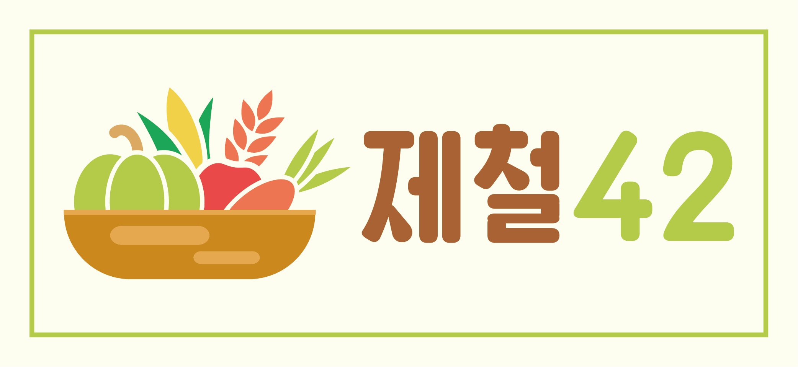

소가구를 대상으로 제철 수확물을 알리고, 지역 기반 나눔을 추구하는 온라인 커뮤니티 웹 사이트입니다.

https://jecheol42.herokuapp.com/#/

### 개발 환경 및 언어

### 데이터베이스

 &nbsp; **[Cloudinary]**

### 배포 플랫폼

### 정보 제공

<a href="https://www.kamis.or.kr/customer/reference/openapi_list.do">한국농수산식품유통공사(aT-Kamis)</a>

### 협업 도구

### 시연 영상

<a href="https://www.youtube.com/watch?v=hERhz800fU8"> 🍿 전체 영상보기</a>

